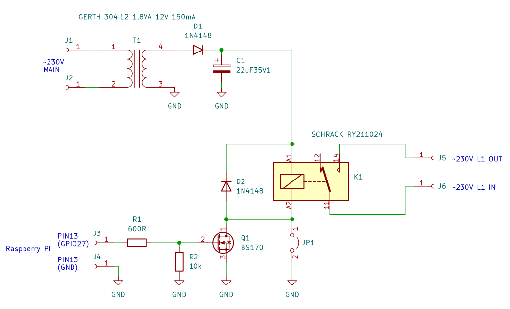

# Audio SW

I use a Rapsberry PI 4 as Audio player with Volumio. The Music Player can be controlled remotely by a nice WEB Interface. Just my Amplifier had to be switch ON and OFF manualy. Since I offten forget to switch the Amplifier OFF I come up with the Idea to control the Amplifier by the Rapsberry PI.

This project Include a sample Schematic for the Hardware and all Code to perform automatic ON/OFF switching of an Amplifier depending if the Raspberry plays Music or not.

The script `audiosw.sh` switch on `GPIO27` 10 second after the Rapsberry PI start playing music.
The `GPIO27` will be switched of 5 Minutes after the Rapsberry PI stops playing music.


## Install 

1. copy `audiosw.sh` to the directory `/usr/local/bin/`
2. copy `audiosw.service` to the directory `/etc/systemd/system/`
3. Enable and start the service with:

```bash
systemctl start audiosw.service
systemctl enable audiosw.service
```

## Schematic

In the folder you can find an Example Schematic for the Audio-Switch Hardware as KiCAD project.
The circuit is **dangerous** since it runs with **230V AC**. So please **pay Attention**!



Jumper JP1 can be used to force the Relay to be switched ON.


## Bill off Material

| Qty. | Parts  | Manufacture | Part-No.     |
| ---: | :----- | :---------- | :----------- |
|    1 | T1     | GERTH       | 304.12.1     |
|    2 | D1, D2 |             | 1N4148       |
|    1 | C1     |             | 22uF 35V     |
|    1 | R1     |             | 600R 0.5W 1% |
|    1 | R2     |             | 10k 0.5W 1%  |
|    1 | Q1     | TE/SCHRACK  | RY211024     |
|    1 | JP1    |             | 2 Pin Header |
